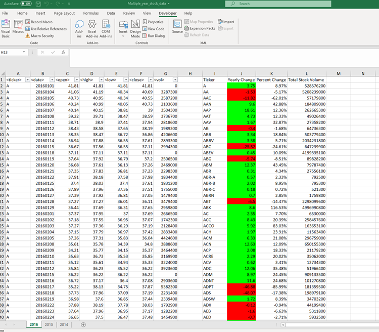
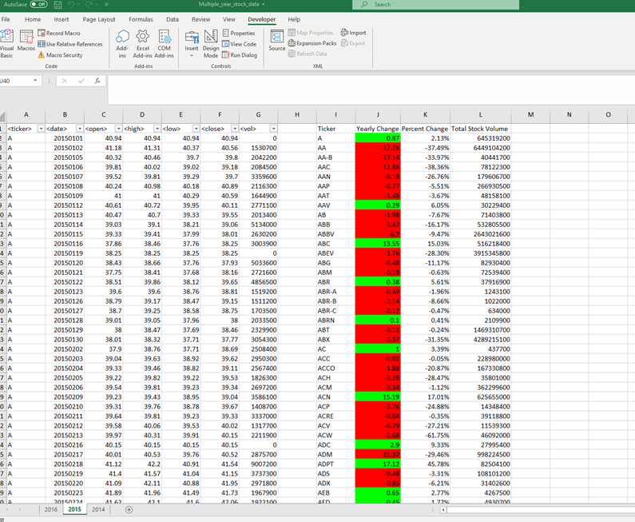
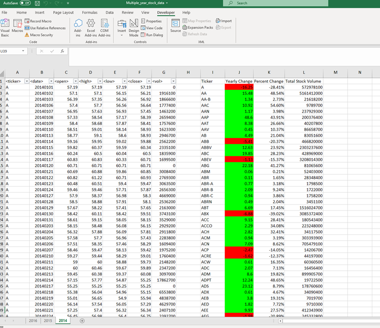

# VBA-Challenge

* This assignment required me to create a script that would loop through all the stocks for one year and output the following information.

  * The ticker symbol.

  * Yearly change from opening price at the beginning of a given year to the closing price at the end of that year.

  * The percent change from opening price at the beginning of a given year to the closing price at the end of that year.

  * The total stock volume of the stock.

* Conditional formatting that would highlight a positive yearly change in green and negative change in red.

* I also made adjustments to my script so that it would run on every worksheet when running the script once.

## Screenshots from the Assignment:
*2016

*2015

*2014

